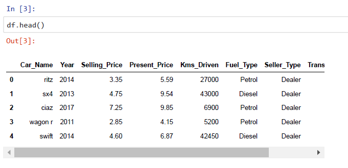
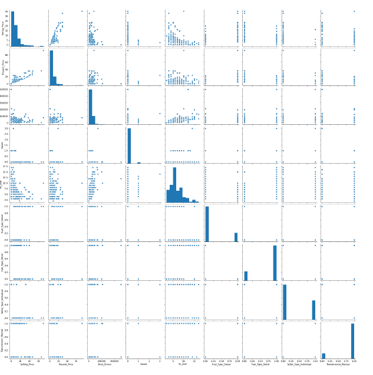
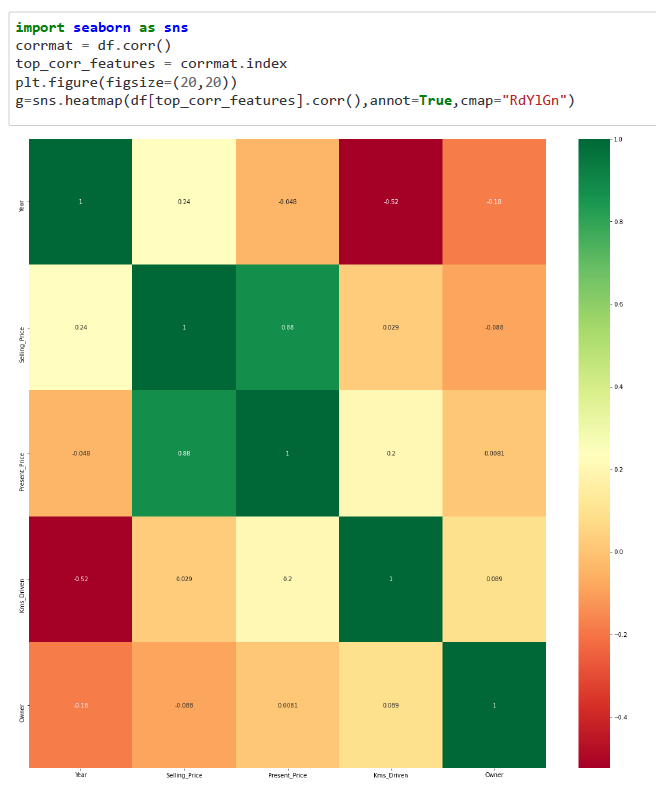
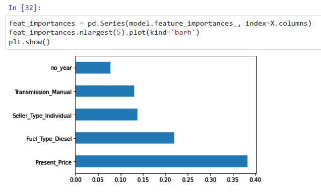
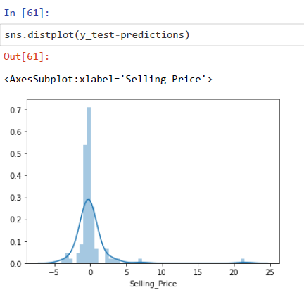
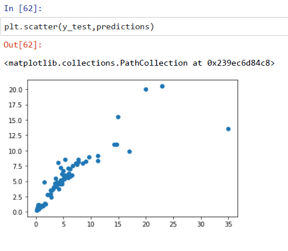

# car-price-prediction
Predicting the value of car by considering various features.

Dataset Head

Pair Plot graph between the features extracted

Correlation Heat map graph

Imaport feature Bar Chart Plot

Prediction Displot Chart

Prediction Scatterplot Chart

